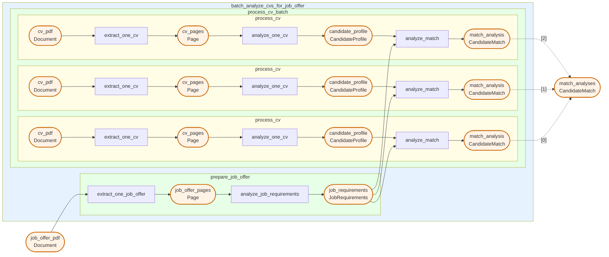

<div align="center">
  <a href="https://www.pipelex.com/"></a>

  <br/>
  <br/>
  <br/>
  <h2 align="center">Build & Run AI Methods</h2>
  <p align="center">A method is a reusable, typed AI procedure — declared in a <code>.mthds</code> file and executed by Pipelex.<br/>
Each step is explicit, each output is structured, and every run is repeatable.</p>


  <div>
    <a href="https://go.pipelex.com/demo"><strong>Demo</strong></a> -
    <a href="https://docs.pipelex.com/"><strong>Documentation</strong></a> -
    <a href="https://mthds.sh"><strong>Hub</strong></a> -
    <a href="https://github.com/Pipelex/pipelex/issues"><strong>Report Bug</strong></a> -
    <a href="https://github.com/Pipelex/pipelex/discussions"><strong>Feature Request</strong></a>
  </div>
  <br/>

  <p align="center">
    <a href="LICENSE"></a>
    <a href="https://github.com/Pipelex/pipelex/tree/main/tests"></a>
    <a href="https://pypi.org/project/pipelex/"></a>
    <br/>
    <a href="https://go.pipelex.com/discord"></a>
    <a href="https://www.youtube.com/@PipelexAI"></a>
    <a href="https://pipelex.com"></a>
    <a href="https://github.com/Pipelex/pipelex-cookbook/tree/main"></a>
    <a href="https://docs.pipelex.com/"></a>
    <a href="https://docs.pipelex.com/changelog/"></a>
    <br/>
    <br/>
</div>


## What a Method Looks Like

```toml
[pipe.summarize_article]
type    = "PipeLLM"
inputs  = { article = "Text", audience = "Text" }
output  = "Text"
prompt  = "Summarize $article in three bullet points for $audience."
```

From here, Pipelex handles model routing across 60+ models, structured output parsing, and pipeline orchestration.

## Why Methods?

| | |
|---|---|
| **Declarative** — Human-readable `.mthds` files that work across models | **Typed** — Semantic types: AI understands what you mean, every input/output connects with purpose |
| **Repeatable** — Deterministic orchestration with controlled room for AI creativity | **Composable** — Chain pipes into sequences, nest methods inside methods, share with the community |

# Quick Start

```bash
uv tool install pipelex
pipelex init
```

## With Claude Code (Recommended)

Install the `mthds` npm package:

```bash
npm install -g mthds
```

Start Claude Code:

```bash
claude
```

Tell Claude to install the MTHDS skills marketplace:

```
/plugin marketplace add mthds-ai/mthds-plugins
```

then install the MTHDS skills plugin:

```
/plugin install mthds@mthds-ai-mthds-plugins
```

then you must exit Claude Code and reopen it.

```
/exit
```

Build your first method:

```
/mthds-build A method to summarize articles with key takeaways for different audiences
```

Run it:

```
/mthds-run
```

## Without Claude Code

1. Install the [VS Code extension](https://go.pipelex.com/vscode) for `.mthds` syntax highlighting
2. Browse methods on the [MTHDS Hub](https://mthds.sh) for inspiration
3. Author your own `.mthds` methods based on these examples
4. Validate with `pipelex validate bundle your_method.mthds`
5. Run them with `pipelex run bundle your_method.mthds`
6. View the flowchart in VS Code thanks to the extension

## Configure AI Access

- **Pipelex Gateway (Recommended)** — Free credits, single API key for LLMs, OCR / document extraction, and image generation across all major providers. [Get your key](https://app.pipelex.com/), add `PIPELEX_GATEWAY_API_KEY=your-key-here` to `~/.pipelex/.env`, run `pipelex init`.
- **Bring Your Own Keys** — Use existing API keys from OpenAI, Anthropic, Google, Mistral, etc. See [Configure AI Providers](https://docs.pipelex.com/latest/setup/configure-ai-providers/).
- **Local AI** — Ollama, vLLM, LM Studio, or llama.cpp — no API keys required. See [Configure AI Providers](https://docs.pipelex.com/latest/setup/configure-ai-providers/).


# Real-World Example: CV Batch Screening

A production method that takes a stack of CVs and a job offer PDF, extracts and analyzes each, then scores how well each candidate matches the role.

**cv_batch_screening.mthds**

```toml
[pipe.batch_analyze_cvs_for_job_offer]
type = "PipeSequence"
description = """
Main orchestrator pipe that takes a bunch of CVs and a job offer in PDF format, and analyzes how they match.
"""
inputs = { cvs = "Document[]", job_offer_pdf = "Document" }
output = "CandidateMatch[]"
steps = [
  { pipe = "prepare_job_offer", result = "job_requirements" },
  { pipe = "process_cv", batch_over = "cvs", batch_as = "cv_pdf", result = "match_analyses" },
]
```

<details>
<summary><b>View concepts, supporting pipes, flowchart, and run commands</b></summary>

**Concepts:**

```toml
[concept.CandidateProfile]
description = "A structured summary of a job candidate's professional background extracted from their CV."

[concept.CandidateProfile.structure]
skills       = { type = "text", description = "Technical and soft skills possessed by the candidate", required = true }
experience   = { type = "text", description = "Work history and professional experience", required = true }
education    = { type = "text", description = "Educational background and qualifications", required = true }
achievements = { type = "text", description = "Notable accomplishments and certifications" }

[concept.JobRequirements]
description = "A structured summary of what a job position requires from candidates."

[concept.JobRequirements.structure]
required_skills  = { type = "text", description = "Skills that are mandatory for the position", required = true }
responsibilities = { type = "text", description = "Main duties and tasks of the role", required = true }
qualifications   = { type = "text", description = "Required education, certifications, or experience levels", required = true }
nice_to_haves    = { type = "text", description = "Preferred but not mandatory qualifications" }

[concept.CandidateMatch]
description = "An evaluation of how well a candidate fits a job position."

[concept.CandidateMatch.structure]
match_score        = { type = "number", description = "Numerical score representing overall fit percentage between 0 and 100", required = true }
strengths          = { type = "text", description = "Areas where the candidate meets or exceeds requirements", required = true }
gaps               = { type = "text", description = "Areas where the candidate falls short of requirements", required = true }
overall_assessment = { type = "text", description = "Summary evaluation of the candidate's suitability", required = true }
```

<details>
<summary><b>Click to view the supporting pipes implementation</b></summary>

```toml
[pipe.prepare_job_offer]
type = "PipeSequence"
description = """
Extracts and analyzes the job offer PDF to produce structured job requirements.
"""
inputs = { job_offer_pdf = "Document" }
output = "JobRequirements"
steps = [
  { pipe = "extract_one_job_offer", result = "job_offer_pages" },
  { pipe = "analyze_job_requirements", result = "job_requirements" },
]

[pipe.extract_one_job_offer]
type        = "PipeExtract"
description = "Extracts text content from the job offer PDF document"
inputs      = { job_offer_pdf = "Document" }
output      = "Page[]"
model       = "@default-text-from-pdf"

[pipe.analyze_job_requirements]
type = "PipeLLM"
description = """
Parses and summarizes the job requirements from the extracted job offer content, identifying required skills, responsibilities, qualifications, and nice-to-haves
"""
inputs = { job_offer_pages = "Page" }
output = "JobRequirements"
model = "$writing-factual"
system_prompt = """
You are an expert HR analyst specializing in parsing job descriptions. Your task is to extract and summarize job requirements into a structured format.
"""
prompt = """
Analyze the following job offer content and extract the key requirements for the position.

@job_offer_pages
"""

[pipe.process_cv]
type = "PipeSequence"
description = "Processes one application"
inputs = { cv_pdf = "Document", job_requirements = "JobRequirements" }
output = "CandidateMatch"
steps = [
  { pipe = "extract_one_cv", result = "cv_pages" },
  { pipe = "analyze_one_cv", result = "candidate_profile" },
  { pipe = "analyze_match", result = "match_analysis" },
]

[pipe.extract_one_cv]
type        = "PipeExtract"
description = "Extracts text content from the CV PDF document"
inputs      = { cv_pdf = "Document" }
output      = "Page[]"
model       = "@default-text-from-pdf"

[pipe.analyze_one_cv]
type = "PipeLLM"
description = """
Parses and summarizes the candidate's professional profile from the extracted CV content, identifying skills, experience, education, and achievements
"""
inputs = { cv_pages = "Page" }
output = "CandidateProfile"
model = "$writing-factual"
system_prompt = """
You are an expert HR analyst specializing in parsing and summarizing candidate CVs. Your task is to extract and structure the candidate's professional profile into a structured format.
"""
prompt = """
Analyze the following CV content and extract the candidate's professional profile.

@cv_pages
"""

[pipe.analyze_match]
type = "PipeLLM"
description = """
Evaluates how well the candidate matches the job requirements, calculating a match score and identifying strengths and gaps
"""
inputs = { candidate_profile = "CandidateProfile", job_requirements = "JobRequirements" }
output = "CandidateMatch"
model = "$writing-factual"
system_prompt = """
You are an expert HR analyst specializing in candidate-job fit evaluation. Your task is to produce a structured match analysis comparing a candidate's profile against job requirements.
"""
prompt = """
Analyze how well the candidate matches the job requirements. Evaluate their fit by comparing their skills, experience, and qualifications against what the position demands.

@candidate_profile

@job_requirements

Provide a comprehensive match analysis including a numerical score, identified strengths, gaps, and an overall assessment.
"""
```

</details>

<details>
<summary><b>View the pipeline flowchart</b></summary>



</details>

### Run Your Method

**Via CLI:**

```bash
pipelex run bundle cv_batch_screening.mthds --inputs inputs.json
```

Create an `inputs.json` file with your PDF URLs:

```json
{
  "cvs": {
    "concept": "native.Document",
    "content": [
      { "url": "https://pipelex-web.s3.amazonaws.com/demo/John-Doe-CV.pdf" },
      { "path": "inputs/Jane-Smith-CV.pdf" }
    ]
  },
  "job_offer_pdf": {
    "concept": "native.Document",
    "content": {
      "url": "https://pipelex-web.s3.amazonaws.com/demo/Job-Offer.pdf"
    }
  }
}
```

**Via Python:**

```python
import asyncio
from pipelex.core.stuffs.document_content import DocumentContent
from pipelex.pipelex import Pipelex
from pipelex.pipeline.runner import PipelexRunner
# Generated by: `pipelex build structures bundle cv_batch_screening.mthds`
from structures.cv_batch_screening__candidate_match import CandidateMatch

async def run_pipeline() -> list[CandidateMatch]:
    runner = PipelexRunner()
    response = await runner.execute_pipeline(
        pipe_code="batch_analyze_cvs_for_job_offer",
        inputs={
            "cvs": {
                "concept": "Document",
                "content": [
                    DocumentContent(url="https://pipelex-web.s3.amazonaws.com/demo/John-Doe-CV.pdf"),
                    DocumentContent(path="inputs/Jane-Smith-CV.pdf"),
                ],
            },
            "job_offer_pdf": {
                "concept": "native.Document",
                "content": DocumentContent(url="https://pipelex-web.s3.amazonaws.com/demo/Job-Offer.pdf"),
            },
        },
    )
    pipe_output = response.pipe_output
    print(pipe_output)
    return pipe_output.main_stuff_as_items(item_type=CandidateMatch)

Pipelex.make()
asyncio.run(run_pipeline())
```

</details>


## See Pipelex in Action

**Claude Code builds your AI Method**

<a href="https://go.pipelex.com/demo">
  
</a>

## IDE Extension

We **highly** recommend installing our extension for `.mthds` syntax highlighting in your IDE:

- **VS Code**: Install from the [VS Code Marketplace](https://marketplace.visualstudio.com/items?itemName=pipelex.pipelex)
- **Cursor, Windsurf, and other VS Code forks**: Install from the [Open VSX Registry](https://open-vsx.org/extension/Pipelex/pipelex), or search for "Pipelex" directly in your extensions tab

Running `pipelex init` will also offer to install the extension automatically if it detects your IDE.

## Run Anywhere

The same `.mthds` file runs from multiple execution targets:

| Target | How |
|--------|-----|
| **CLI** | `pipelex run bundle method.mthds --inputs inputs.json` |
| **Python** | `PipelexRunner().execute_pipeline(...)` |
| **REST API** | Self-hosted API server |
| **MCP** | Model Context Protocol — agents call methods as tools |
| **n8n** | Pipelex node for workflow automation |


# The MTHDS Ecosystem

| | Description | Link |
|---|---|---|
| **MTHDS Standard** | The open standard specification — language, package system, and typed concepts | [mthds.ai](https://mthds.ai/latest/) |
| **MTHDS Hub** | Discover and share methods — browse packages, search by signature | [mthds.sh](https://mthds.sh) |
| **MTHDS Plugins** | Claude Code plugin — commands to build, run, edit, check, fix, and publish methods | [github.com/mthds-ai/mthds-plugins](https://github.com/mthds-ai/mthds-plugins) |
| **Package System** | Versioned dependencies, lock files with SHA-256 integrity, cross-package references via `->` | [Packages docs](https://mthds.ai/latest/packages/structure/) |
| **Know-How Graph** | Typed discovery — "I have X, I need Y" — find methods or chains by typed signature | [Know-How Graph](https://mthds.ai/latest/know-how-graph/) |

<details>
<summary><b>View MTHDS skills</b></summary>

| Command | Description |
|---------|-------------|
| `/mthds-build` | Build new AI method bundles from scratch |
| `/mthds-run` | Execute methods and interpret their JSON output |
| `/mthds-edit` | Modify existing methods — change pipes, update prompts, add steps |
| `/mthds-check` | Validate bundles for issues (read-only) |
| `/mthds-fix` | Auto-fix validation errors |
| `/mthds-explain` | Walk through execution flow in plain language |
| `/mthds-inputs` | Prepare inputs: templates, synthetic data, user files |
| `/mthds-install` | Install method packages from GitHub or local dirs |
| `/mthds-pkg` | Package management — init, deps, lock, install, update |
| `/mthds-publish` | Publish methods to the hub |
| `/mthds-share` | Share methods on social media |

</details>


## Examples & Cookbook

Explore real-world examples in our **Cookbook** repository:

[](https://github.com/Pipelex/pipelex-cookbook/tree/main)

Clone it, fork it, and experiment with production-ready methods for various use cases.

## Optional Features

The package supports the following additional features:

- `anthropic`: Anthropic/Claude support for text generation
- `google`: Google models (Vertex) support for text generation
- `mistralai`: Mistral AI support for text generation and OCR
- `bedrock`: Amazon Bedrock support for text generation
- `fal`: Image generation with Black Forest Labs "FAL" service
- `linkup`: Web search with Linkup
- `docling`: OCR with Docling

Install all extras:

```bash
pip install "pipelex[anthropic,google,google-genai,mistralai,bedrock,fal,linkup,docling]"
```

---

**Privacy & Telemetry** — Pipelex Gateway collects only technical data (model names, token counts, latency) — never prompts or business data. If you want to avoid Gateway telemetry, disable `pipelex_gateway` and use your own provider keys or local AI instead. [Learn more](https://docs.pipelex.com/latest/setup/telemetry/)

**Contributing** — We welcome contributions! See our [Contributing Guidelines](CONTRIBUTING.md).

**Community** — [](https://go.pipelex.com/discord) [GitHub Issues](https://github.com/Pipelex/pipelex/issues) · [Discussions](https://github.com/Pipelex/pipelex/discussions) · [Documentation](https://docs.pipelex.com/)

## License

This project is licensed under the [MIT license](LICENSE). Runtime dependencies are distributed under their own licenses via PyPI.

---

"Pipelex" is a trademark of Evotis S.A.S.

© 2025-2026 Evotis S.A.S.
